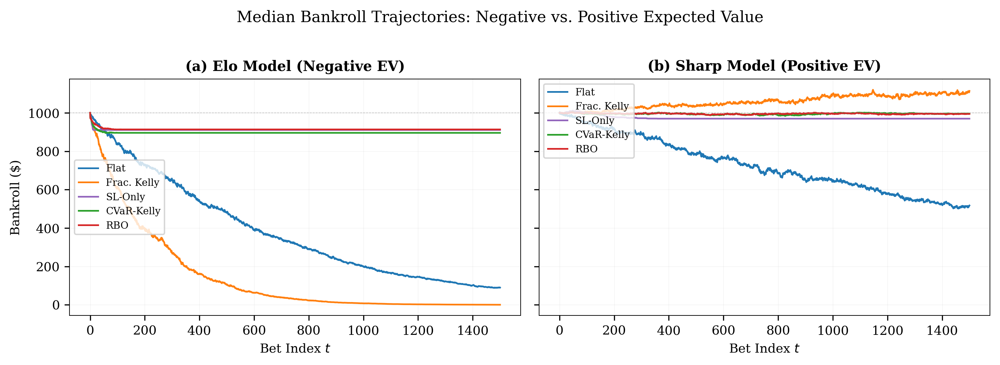
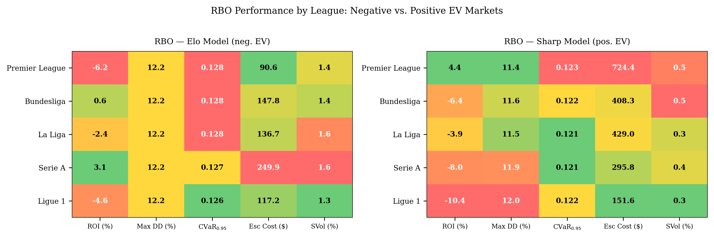

# Responsible Bankroll Optimization (RBO)

**A framework for integrating responsible gambling constraints into algorithmic sports betting.**

## Overview

Algorithmic sports betting systems traditionally focus on profit maximization, often neglecting user safety. Strategies like the **Kelly criterion** are mathematically rigorous but can lead to extreme volatility and encourage loss-chasing behaviors.

**Responsible Bankroll Optimization (RBO)** bridges the gap between algorithmic efficiency and duty-of-care obligations. It formulates staking as a **Constrained Markov Decision Process (CMDP)** that balances growth objectives with strict constraints on:
*   **Financial Tail Risk** (via Conditional Value-at-Risk, CVaR)
*   **Behavioral Harm** (via loss-chasing penalties and risk scores)

## Key Features

*   **Harm-Aware Optimization**: Embeds safety directly into the staking engine, not just as an external "brake."
*   **Behavioral Risk Scoring**: Calculates a dynamic risk score ($z_t$) based on loss streaks, stake volatility, and escalation patterns.
*   **Governance Layer**: Provides transparent, auditable logs for every staking decision (e.g., "Stake reduced due to high risk score").
*   **Safety Corridor**: Creates a safe operating zone that prevents ruin while preserving upside potential.

## Results

### 1. Capital Preservation & Growth
RBO prevents catastrophic ruin in negative-EV markets (left) and ensures steady, less volatile growth in positive-EV "sharp" markets (right), significantly outperforming standard Kelly strategies in safety.



### 2. Behavioral Monitoring Dashboard
The system dynamically monitors behavioral risk. As the risk score (bottom panel, red line) rises, RBO automatically dampens stake sizes (middle panel) to prevent spiraling losses.


### 3. Performance Across Leagues
RBO's safety benefits are consistent across different European football leagues, maintaining low drawdown and tail risk regardless of the specific market conditions.



## Installation & Usage

### Prerequisites
*   Python 3.8+
*   `numpy`
*   `pandas`
*   `matplotlib`
*   `scikit-learn`

### Running the Simulation
The core logic and simulation engine are contained in `rbo_corrected.py`.

```bash
python rbo_corrected.py
```

This script will:
1.  Load the dataset of 18,010 European football matches.
2.  Calibrate probabilities using Elo ratings.
3.  Run simulations comparing **Flat Staking**, **Fractional Kelly**, **Stop-Loss Only**, **CVaR-Kelly**, and **RBO**.
4.  Generate performance metrics and figure plots in the `figures/` directory.

## Citation

If you use this code or framework in your research, please cite:

> **Responsible Bankroll Optimization with Harm-Aware Constraints and Governance**
> *R. M. Galekwa et al.*
## 🙏 Acknowledgments

- [Football-Data.co.uk](https://www.football-data.co.uk/) for historical match data
- [Club Elo](http://clubelo.com/) for Elo rating methodology
- Scikit-learn team for the excellent ML library

## License

[MIT License](LICENSE)
